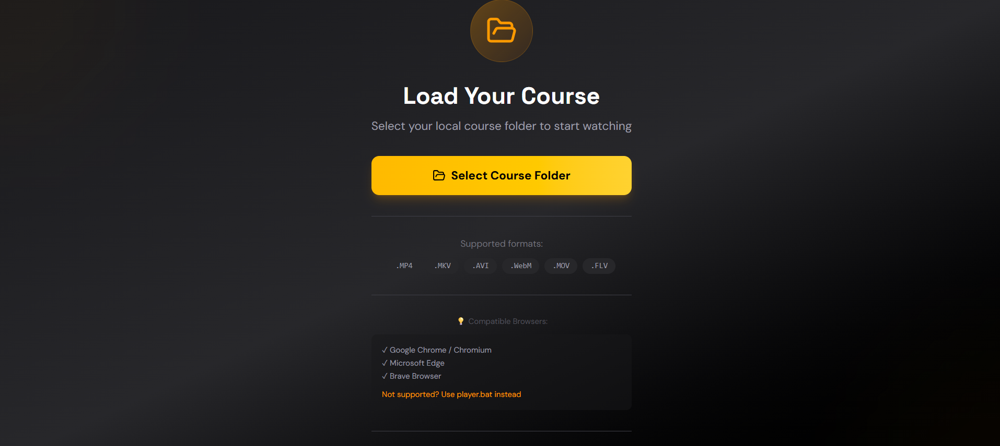
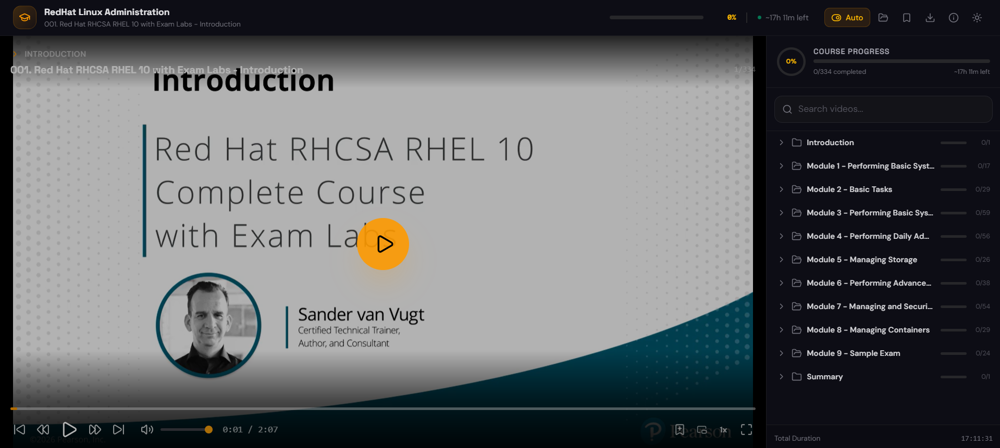

# Course Player

A local-first video course player built with React, TypeScript, and Vite.

Load a course folder from your computer, browse videos by folder, track progress, save bookmarks, and continue where you stopped. All data stays in your browser.

## Screenshots





## Repository

```bash
git clone git@github.com:0xyo/course_player.git
cd course_player
```

## Features

- Load local course folders with nested video files
- Keep the original folder structure as a playlist
- Track watched videos and last playback position
- Add and jump to bookmarks
- Search videos by name or folder
- Change playback speed
- Skip forward/backward by 10 seconds
- Autoplay the next video
- Toggle dark/light theme
- Use keyboard shortcuts
- Run as a Vite app or standalone browser player

## Requirements

- Node.js 18+
- Chrome, Edge, or Brave for local folder access

## Development

```bash
npm install
npm run dev
```

Build for production:

```bash
npm run build
```

Preview the production build:

```bash
npm run preview
```

Run linting:

```bash
npm run lint
```

## Standalone Player

For offline use without running the React app:

1. Copy `public/standalone-player.html` and `public/player.bat` into a course folder.
2. Double-click `player.bat`.
3. Open the player in your browser and start watching.

## Supported Videos

The player scans subfolders and sorts videos naturally by path.

Supported extensions:

- `.mp4`
- `.mkv`
- `.webm`
- `.avi`
- `.mov`
- `.flv`
- `.m4v`
- `.wmv`
- `.mpg`
- `.mpeg`
- `.3gp`

Browser playback depends on codec support. MP4/H.264 is the safest format.

## Data Storage

Progress is saved locally with `localStorage`:

- watched status
- last playback position
- bookmarks
- playback settings
- theme preference

No course data is uploaded to a server.

## License

MIT
